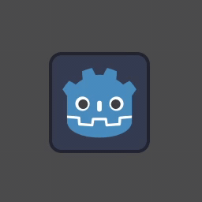
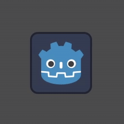
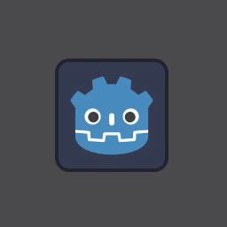
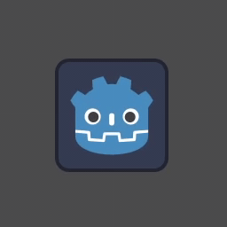
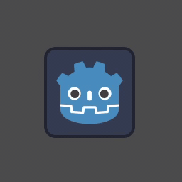
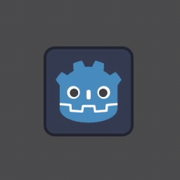
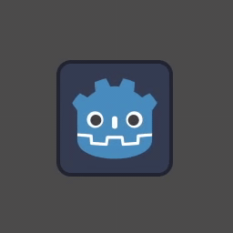
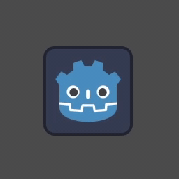

# Tweens2D for Godot 4

Tiny, reusable and chainable tweens for **Godot 4** to add *juice* to any `Control` or `Node2D`.

The tweens are opinionated and preconfigured with sensible defaults. Great for game jams to slam some animations to UI and make it pop!


## Install

1. Copy the files into your project wherever you want (e.g. `res://addons/tweens_2d/`).
2. Check `tweens_2d.gd` and make sure `COLOR_OVERLAY_SHADER` is set to the right location of the shader.

    ```gdscript
    const COLOR_OVERLAY_SHADER = preload("res://addons/tweens_2d/tweens_2D_color_overlay.gdshader")
    ```
3. Autoload `tweens_2d.gd` so you can access the script everywhere.


## Examples

```gdscript
# Squeeze a button on focus.
$Button.focus_entered.connect(func():
    Tweens2D.add_squeeze(get_tree().create_tween(), $Button)
)

# Animate a logo (infinite loop).
Tweens2D.add_wobble(get_tree().create_tween(), $Logo, {
    "angle_degrees": 10,
    "duration": 5
}).set_loops(0)

# Chain animations. The icon will appear, pulse 3 times, then disappears.
var tween = get_tree().create_tween()
Tweens2D.add_appear(tween, $Icon)
Tweens2D.create_loop(tween, 3, func(loop_tween):
    Tweens2D.add_pulse(loop_tween, $Icon)
)
Tweens2D.add_disappear(tween, $Icon)
```


## Concept

All helper functions are mutators: they don’t create new `Tween` instances. Instead, they take an existing `Tween` as the first argument and append their animation steps to it. Because they mutate the passed-in tween in place, you can chain multiple helpers on the same tween without reassigning.

A dictionary of options to override animation settings can be supplied as the third parameter. See `tweens_2d.gd` for exact options & defaults. 

Use `create_loop` to repeat a subsection of the tween chain without looping the entire tween. See the example above.


## 🔎 API cheatsheet

### Appear

Creates an animation that scales the target from zero to its default scale.


`add_appear(tween, target, options)`

Options:
* `default_scale: Vector2 = Vector2.ONE`
* `duration: float = 1.0`


### Disappear

Creates an animation that scales the target down to zero.



`add_appear(tween, target, options)`

Options:
* `duration: float = 0.4`


### Pulse

Creates an animation that pulses like a heartbeat. **Loopable!**



`add_pulse(tween, target, options)`

Options:
* `amount: float = 1.3`
* `duration: float = 0.4`


### Bob

Creates an animation that bobs the target in a given direction. **Loopable!**


`add_bob(tween, target, options)`

Options:
* `distance: float = 20.0`
* `duration: float = 0.4`
* `direction: Vector2 = Vector2.UP`


### Bounce

Creates an animation that makes the target bounce in a given direction



`add_bounce(tween, target, options)`

Options:
* `distance: float = 20.0`
* `duration: float = 0.8`
* `direction: Vector2 = Vector2.UP`


### Wobble

Creates an animation that makes the target wobble from right to left.



`add_wobble(tween, target, options)`

Options:
* `angle_degrees: float = 30.0`
* `duration: float = 1.0`
* `snaps: int = 3`


### Squeeze

Creates an animation that squeezes the target like a squeeze ball.



`add_squeeze(tween, target, options)`

Options:
* `duration: float = 0.8`
* `max_scale: float = 1.2`
* `min_scale: floar = 0.2`


### Spin

Creates an animation that spins the target around.



`add_spin(tween, target, options)`

Options:
* `direction: int = 1`
* `duration: float = 0.8`
* `keep_base: bool = false`
* `num_of_spins: int = 1`


### Flip

Creates an animation that flips the target like a card.

Note that the flip animation has a `halfway_callback` option. Supply a `Callable` that changes the card between open and closed state, for a true card-flipping effect.


`add_flip(tween, target, options)`

Options:
* `axis: Vector2 = Vector2.UP`
* `duration: float = 0.6`
* `halfway_callback: Callable`


### Shake

Creates an animation that shakes the target around.



`add_shake(tween, target, options)`

Options:
* `range: float = 10.0`
* `duration: float = 1.0`
* `intval: float = 0.02`
* `decay: float = 1.0`


### Flash

Creates an animated color flash over the target. A new shader material will be assigned to the target, and removed afterwards.

The included shader tints any `CanvasItem` toward a color. It’s generic and reusable outside `Tweens2D`, and it respects existing `modulate/self_modulate`.



`add_flash(tween, target, options)`

Options:
* `flash_color: Color = Color.WHITE`
* `amount: float = 0.8`
* `fade_duration: float = 0.2`
* `hold_duration: float = 0`


## Usage notes

- **Pivot/center.** For `Control`, set `pivot_offset = size * 0.5` so scale/rotation effects are centered. For `Sprite2D`, ensure `centered` is enabled (or set a custom pivot if needed).
- **Interactive nodes.** On widgets like `Button`, avoid tweening the button node itself; it can trigger an unexpected `mouse_exited`. Tween a visual child instead (e.g., a `TextureRect` or `Label`). If needed, set the child’s `mouse_filter = MOUSE_FILTER_IGNORE`.


## 📄 License

MIT License  
Copyright (c) 2025 Bauke Regnerus
